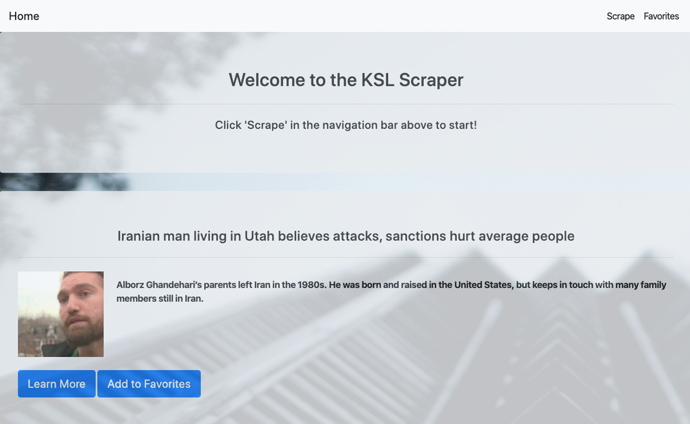

# article-scraper

<h2> <a href="https://lit-scrubland-80180.herokuapp.com/">An exercise in scraping</a></h2>
&nbsp;

<h2>How it works</h2>

This scraper site uses Cherio to search for news headlines from www.KSL.com and displays. By clicking 'Learn More' you will be directed to the article. If you find something you like, you can click 'Add to Favorites.' The article will then be saved in a Mongo Database. Favorites will be displayed on the favorites page. If you want to see new article, simply click 'Scrape' in the top left corner of the page.

<h3>This project was built with:</h3>
<ul>
    <li>JavaScript</li>
    <li>jQuery</li>
    <li>CSS</li>
    <li>Bootstrap</li>
    <li>HTML</li>
    <li>mongoDB</li>
    <li>Mongoose</li>
    <li>Cherio</li>
    <li>Axios</li>
    <li>Express</li>
    <li>Handlebars.js</li>
    <li>Node</li>
    <li>Hosted on Heroku</li>
</ul>